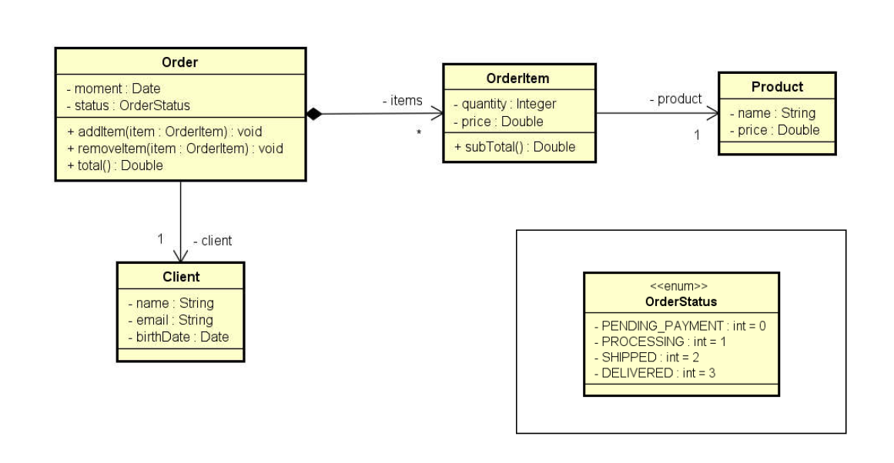

<h1>Order Project<h1>

Sistema para inserir produtos em um sistema desenvolvido durante o curso "Java COMPLETO Programação Orientada a Objetos + Projetos" ministrado pelo Professor Nelio Alves na Udemy

<h2>Diagrama de classes</h2>

Diagrama de classes oferecido para a realização do exercício:

